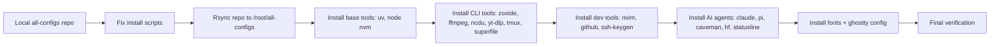

# GPU config deploy complete



## What
- Deployed all Linux-compatible modules from `all-configs` to the Vast.ai GPU container `151.237.25.234:28220`.
- Fixed three installer bugs before deploying:
  - `uv/install.sh` had a corrupted `printf` line; rewrote it.
  - `node/install.sh` used wrong package name `node` on Ubuntu and ignored nvm; added nvm-first logic.
  - `zoxide/install.sh` passed `bashrc` to `zoxide init`; fixed to `bash`.
- Synced repo with `rsync` into `/root/all-configs`.
- Ran module installers; resolved failures iteratively.
- Generated SSH key for GitHub and updated `~/.ssh/config`.
- Added `fd`/`bat` symlinks in `~/.local/bin` because Debian package binaries are `fdfind`/`batcat`.

## Key Takeaways
- Vast.ai base image already has nvm at `/opt/nvm` with Node v24.19.0; system apt only provides Node 18.
- `pi` and `skills` require Node ≥22; they failed until nvm Node 24 was forced onto PATH.
- `claude` installs to `~/.local/bin`; interactive shell loads it via `.bashrc`.
- `.bashrc` on the image auto-starts tmux over SSH, which breaks non-interactive verification unless `TMUX_STARTED=1`.

## Issues
| Issue | Workaround |
|-------|------------|
| `node` apt package missing | Use nvm Node 24; fallback to `npm` apt package removed. |
| `pi`/`skills` crashed with `SyntaxError: Unexpected token 'with'` | They were running under Node 18. Reinstalled with Node 24. |
| `skills` npx failed on `styleText` import | Same root cause: Node 18. |
| `fd`/`bat` commands missing | Installed `fd-find`; created symlinks `~/.local/bin/fd → fdfind`, `~/.local/bin/bat → batcat`. |
| `ssh-keygen` defaulted to container hostname | Ran installer explicitly with `-H github.com -u git`. |

## Decisions
- Used `/root/all-configs` as install root (not `/workspace`, because `workspace_is_volume: false`).
- Skipped mac-only modules: aldente, aqua-voice, betterdisplay, bitwarden, browsers, codex, docker, karabiner, keycastr, moshi, presentify, raycast, rectangle, shortcat, slack, spotify, tailscale, vlc, vscode, zed.
- Left QuickCall `skills` global install warning as-is; Pi system skills were installed manually via the local `skills/` copy.

## Next
- Add the public SSH key to GitHub for `git@github.com` auth:
  ```
  ssh-ed25519 AAAAC3NzaC1lZDI1NTE5AAAAICX5NQU0LjD2lKxsakXEHLy1h/cT0MKxGZSkxqjweIIY sagarsarkale.work@gmail.com
  ```
- Run `ssh -p 28220 -i ~/.ssh/vast-ai root@151.237.25.234` to use the interactive shell; tmux will auto-attach.
- If running non-interactive commands remotely, prefix with `export PATH="/opt/nvm/versions/node/v24.19.0/bin:$HOME/.local/bin:$PATH"` or use an interactive shell.
- To make the install reproducible, commit the modified `node/install.sh`, `uv/install.sh`, and `zoxide/install.sh` to this repo.
