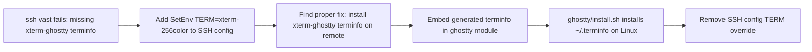

# Ghostty terminfo fix

## What
- Fixed the `missing or unsuitable terminal: xterm-ghostty` error on SSH login.
- Added `ghostty/xterm-ghostty.terminfo` generated from the local Ghostty app.
- Updated `ghostty/install.sh` to install the terminfo into `~/.terminfo` on Linux using `tic -x`.
- Removed the local `SetEnv TERM=xterm-256color` workaround from `~/.ssh/config`.

## Key Takeaways
- Ghostty sets `TERM=xterm-ghostty`; most remote containers don't have that terminfo entry.
- The official Ghostty repo keeps the entry in Zig source, not a downloadable `.terminfo` file.
- Vendoring a locally generated `xterm-ghostty.terminfo` makes the installer self-contained and network-free.

## Issues
- `tic` prints a warning about older versions treating the description field as an alias — safe to ignore.
- Local port forwarding on `8080` can conflict if another `ssh vast` session is active. Use a different local port or close the other session.

## Decisions
- Keep the terminfo file in the repo instead of downloading from Ghostty's source tree.
- Continue to not install the full Ghostty binary on Linux (not available via apt); only the config + terminfo.

## Next
- Commit and push `ghostty/xterm-ghostty.terminfo` and `ghostty/install.sh` changes.
- Test `ssh vast` interactively.
