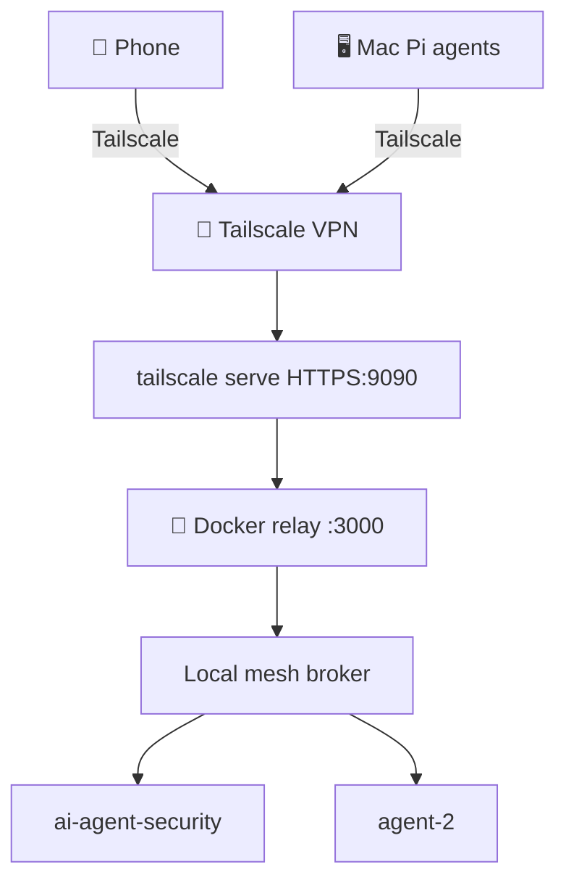
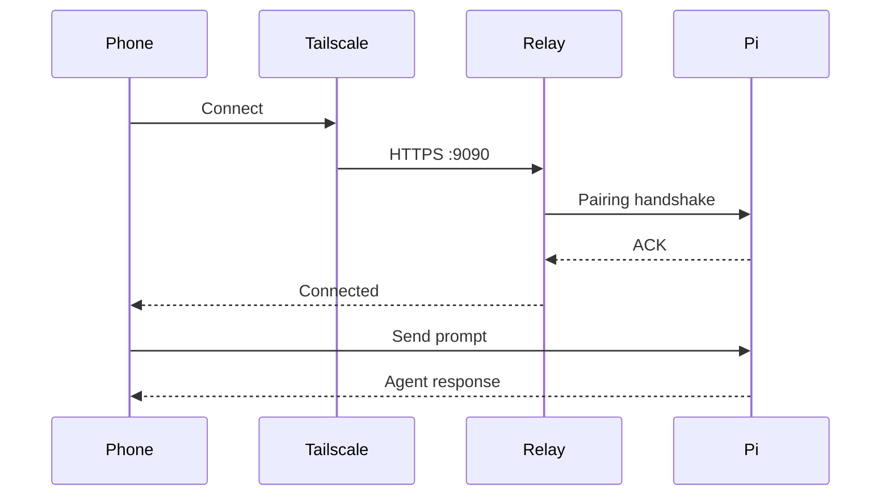

# Remote Pi with Tailscale Relay Setup

Self-hosted Remote Pi relay behind Tailscale VPN for private agent mesh + mobile control.

## Architecture



## Prerequisites

- Docker
- Tailscale account + app on all devices
- Pi coding agent installed
- Remote Pi Pi extension (`pi install npm:remote-pi`)

## Step 1: Install Tailscale

```bash
brew install tailscale
# Or install macOS GUI: brew install --cask tailscale-app
```

Open Tailscale app, sign in. Verify:

```bash
tailscale status
# Should show: 100.x.x.x  hostname  your@account  macOS  -
```

Note your MagicDNS name:

```bash
tailscale status --json | python3 -c "import json,sys; print(json.load(sys.stdin)['Self']['DNSName'])"
# Example: hostname.tailxxxxx.ts.net
```

## Step 2: Run Docker Relay

```bash
docker run -d \
  --name remote-pi-relay \
  -p 9090:3000 \
  -v remote-pi-data:/data \
  --restart unless-stopped \
  jacobmoura7/remote-pi-relay
```

Verify:

```bash
curl http://localhost:9090/health
# Should return: OK
```

## Step 3: Enable Tailscale Serve

Enable HTTPS serving in Tailscale admin console (one-time per tailnet):

Open: `https://login.tailscale.com/f/serve` and enable.

Then expose relay over Tailscale with auto-TLS:

```bash
tailscale serve --bg --https=9090 http://localhost:9090
```

Verify:

```bash
tailscale serve status
# Should show: https://hostname.tailxxxxx.ts.net:9090 (tailnet only)
```

`(tailnet only)` means only reachable from within your Tailscale network — correct.

## Step 4: Configure Remote Pi

In any Pi session:

```
/remote-pi setup
```

Set agent name, enable relay. Then point at your self-hosted relay:

```
/remote-pi set-relay https://HOSTNAME.tailxxxxx.ts.net:9090
/remote-pi stop
/remote-pi
```

Verify:

```
/remote-pi status
# Should show:
# 🟢 Local mesh: connected as "agent-name" (N peers)
# 🟢 Relay: on, connected (https://HOSTNAME.tailxxxxx.ts.net:9090)
```

## Step 5: Pair Mobile App

### On Phone

1. Install Tailscale from App Store, sign in to same tailnet
2. Install Remote Pi app
3. In app settings, set relay to `https://HOSTNAME.tailxxxxx.ts.net:9090`
4. Verify relay connection (app shows green indicator)

### On Mac

```
/remote-pi pair
```

Scan QR code with Remote Pi app's built-in scanner (NOT camera app).

## Verification



## Troubleshooting

### Phone cannot reach relay

- Phone must have Tailscale installed and connected to same tailnet
- Test: open `https://HOSTNAME.tailxxxxx.ts.net:9090/health` in phone browser — should show `OK`

### App pairing fails

- Must set custom relay URL in app settings BEFORE scanning QR
- Relay URL must match on both Pi and phone
- Use app's built-in QR scanner, not phone camera

### Yellow relay status (waiting for pairing)

Normal until first device pairs. Status turns green after pairing.

### Cross-PC access

On second machine, install Tailscale + Pi + Remote Pi extension. Run:

```
/remote-pi set-relay https://HOSTNAME.tailxxxxx.ts.net:9090
/remote-pi
```

Agents discover each other via `list_peers`. Remote peers appear with PC label prefix.
