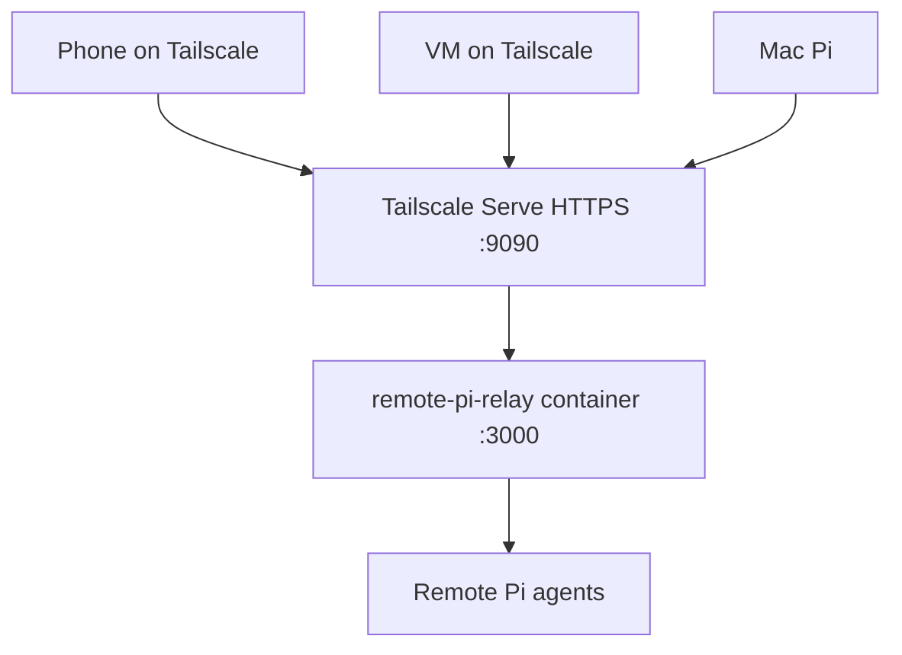

# Remote Pi with Tailscale Relay Setup

Self-host Remote Pi relay behind Tailscale so Mac, VM, phone, and Pi agents share one private mesh.

No personal pairing tokens, QR contents, Owner keys, exact tailnet names, or private device inventory belong in this file.

## What each piece does

- **Tailscale**: private network between your devices. Relay URL only resolves/reaches from same tailnet.
- **Tailscale Serve**: exposes local relay port on a tailnet HTTPS URL.
- **Remote Pi relay**: WebSocket rendezvous/message relay for Remote Pi app and Pi extensions.
- **Remote Pi Pi extension**: adds `/remote-pi`, local mesh, pairing, and cross-machine agent messaging.

Flow:



## Recommended layout

Use Mac as relay host when Mac has stable Tailscale HTTPS Serve URL:

- Relay host: Mac
- Relay public-to-tailnet URL: `https://<mac-magicdns-name>:9090`
- Relay container local URL on Mac: `http://127.0.0.1:3000`
- VM reaches relay through Tailscale URL above.
- Phone must use same relay URL in Remote Pi app settings and must be connected to Tailscale.

Alternative: host relay on VM. Same steps, replace Mac MagicDNS with VM MagicDNS.

## Find Tailscale names and IPs

On any machine:

```bash
tailscale status
```

Machine's own MagicDNS + IP:

```bash
tailscale status --json | python3 -c 'import json, sys; s=json.load(sys.stdin)["Self"]; print("hostname:", s["HostName"]); print("dns:", s["DNSName"].rstrip(".")); print("ip:", s["TailscaleIPs"][0])'
```

List peers:

```bash
tailscale status --json | python3 -c 'import json, sys; data=json.load(sys.stdin); [print(p.get("HostName"), p.get("DNSName", "").rstrip("."), p.get("TailscaleIPs", [""])[0], "online=", p.get("Online")) for p in data.get("Peer", {}).values()]'
```

## Step 1: Install prerequisites

### macOS relay host

```bash
brew install --cask tailscale-app
brew install --cask docker
# Start Tailscale app and Docker Desktop from GUI, then sign in.
```

Verify:

```bash
tailscale status
docker ps
```

### Linux VM/client

```bash
curl -fsSL https://tailscale.com/install.sh | sh
sudo tailscale up --ssh=false
```

Verify:

```bash
tailscale status
```

## Step 2: Run relay container on relay host

On Mac or VM chosen as relay host:

```bash
docker run -d \
  --name remote-pi-relay \
  -p 127.0.0.1:3000:3000 \
  -v remote-pi-data:/data \
  --restart unless-stopped \
  jacobmoura7/remote-pi-relay
```

If container already exists:

```bash
docker start remote-pi-relay
```

Verify local health on relay host:

```bash
curl http://127.0.0.1:3000/health
```

## Step 3: Expose relay with Tailscale Serve

On relay host:

```bash
tailscale serve --https=9090 http://127.0.0.1:3000
```

Verify serve config:

```bash
tailscale serve status
```

Verify from VM or phone browser:

```bash
curl -k https://<relay-host-magicdns>:9090/health
```

Expected: health response from relay. `502` means Tailscale Serve is reachable but backend container/port is wrong or down.

## Step 4: Configure Remote Pi on every machine

Install plugin if missing:

```bash
pi install npm:remote-pi
```

If npm package is stale (crashes on session replacement), install from source:

```bash
git clone https://github.com/jacobaraujo7/remote_pi.git ~/remote_pi
cd ~/remote_pi/pi-extension
npm install && npx tsc
pi install ~/remote_pi/pi-extension
```

To update source build later:

```bash
cd ~/remote_pi && git pull && cd pi-extension && npm install && npx tsc
# dist rebuilds automatically — no re-install needed unless pi re-resolves packages
```

Set same relay URL on Mac and VM:

```text
/remote-pi set-relay https://<relay-host-magicdns>:9090
/remote-pi stop
/remote-pi
```

Or write global config directly:

```bash
mkdir -p ~/.pi/remote
python3 - <<'PY'
import json, pathlib
relay = "https://<relay-host-magicdns>:9090"
p = pathlib.Path.home() / ".pi/remote/config.json"
data = json.loads(p.read_text()) if p.exists() else {}
data["relay"] = relay
p.write_text(json.dumps(data, indent=2) + "\n")
PY
```

Optional project config:

```bash
mkdir -p .pi/remote-pi
cat > .pi/remote-pi/config.json <<'JSON'
{
  "agent_name": "all-configs",
  "auto_start_relay": true
}
JSON
```

## Step 5: Configure phone

On phone:

1. Install Tailscale.
2. Sign in to same tailnet.
3. Confirm relay health in browser: `https://<relay-host-magicdns>:9090/health`.
4. In Remote Pi app settings, set relay URL to same value.
5. Pair from Pi:

```text
/remote-pi pair
```

Scan QR in Remote Pi app. Do not commit QR output or `remotepi://pair?...` URI; it contains short-lived pairing material.

## Step 6: Verify Remote Pi mesh

Inside Pi:

```text
/remote-pi status
/remote-pi peers
```

Expected:

- Relay connected.
- Paired phone visible when online.
- Remote agents appear with machine prefix/address when another Pi is running on same Owner mesh.

Agent tool verification:

```js
list_peers()
```

Send to remote peer using exact address returned by `list_peers()`; never construct address manually.

## Troubleshooting

### Relay connected, then disconnected after pairing

Check all three clients use same relay URL:

- Mac Pi: `/remote-pi config`
- VM Pi: `/remote-pi config`
- Remote Pi app settings

Then restart Pi relay client:

```text
/remote-pi stop
/remote-pi
```

Check relay host:

```bash
docker ps --filter name=remote-pi-relay
docker logs --tail 100 remote-pi-relay
tailscale serve status
curl http://127.0.0.1:3000/health
```

From VM:

```bash
curl -k https://<relay-host-magicdns>:9090/health
```

### `/health` returns 502

Tailscale Serve works, backend does not. Fix on relay host:

```bash
docker start remote-pi-relay
curl http://127.0.0.1:3000/health
tailscale serve --https=9090 http://127.0.0.1:3000
```

### Phone cannot reach relay

- Phone must be connected to Tailscale.
- Remote Pi app relay URL must match Pi relay URL exactly.
- Use `https://<magicdns>:9090`, not `wss://`.

### App pairing fails

- Set custom relay URL in mobile app before scanning QR.
- Use Remote Pi app scanner, not system camera.
- Regenerate QR with `/remote-pi pair`; pairing codes expire.

### Two Pi processes cannot use same folder

Remote Pi allows one Pi process per cwd. For multiple local agents, use separate directories.

## Stop services

On relay host:

```bash
tailscale serve --https=9090 off
docker stop remote-pi-relay
```

## Remove relay container

```bash
docker rm -f remote-pi-relay
docker volume rm remote-pi-data
```
