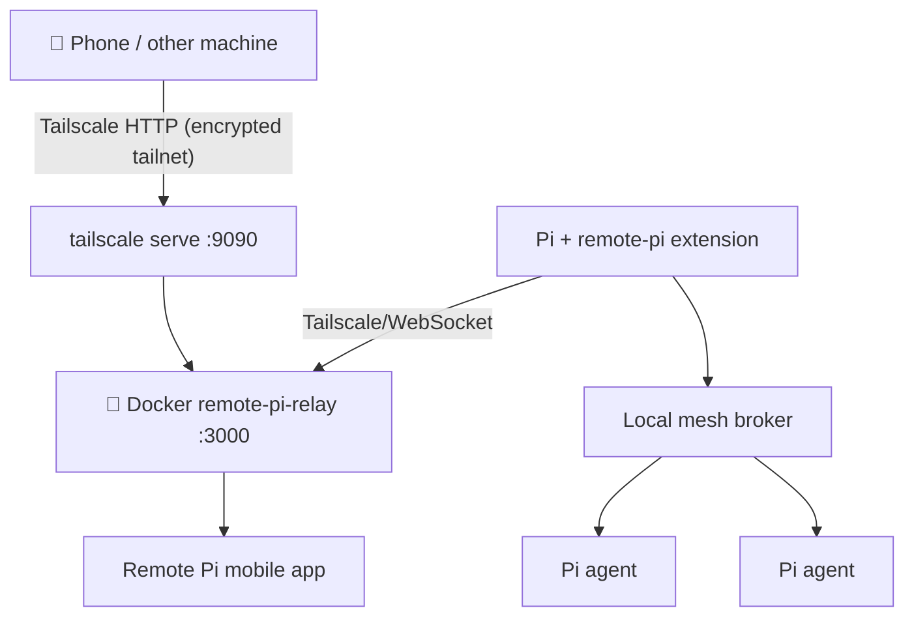

# Remote Pi with Tailscale Relay Setup

Self-hosted Remote Pi relay behind Tailscale VPN for private mobile control + local agent mesh.

## What each piece does

- **Tailscale**: private network between your devices. Only tailnet devices can reach relay URL.
- **Remote Pi relay**: WebSocket rendezvous/message broker for Remote Pi mobile app ↔ Pi extension.
- **Docker relay container**: self-hosted relay process.
- **Remote Pi Pi extension**: adds `/remote-pi`, local agent mesh, mobile pairing, relay client.

Flow:



## Current VM values

- Hostname: `HOSTNAME`
- Tailnet DNS: `HOSTNAME.tailxxxxx.ts.net`
- Relay URL: `http://HOSTNAME.tailxxxxx.ts.net:9090`
- Tailscale IP: `100.x.x.x`
- Local relay health: `http://localhost:9090/health`
- Tailnet relay health: `http://HOSTNAME.tailxxxxx.ts.net:9090/health`

## Prerequisites

- Docker
- Tailscale account + app on all devices
- Pi coding agent installed
- Remote Pi extension: `pi install npm:remote-pi`

## Step 1: Install Tailscale

### Linux (Ubuntu/Debian)

```bash
curl -fsSL https://tailscale.com/install.sh | sh
sudo tailscale up --ssh=false
```

Authenticate in browser when prompted. Verify:

```bash
tailscale status
# Should show: 100.x.x.x  hostname  account  linux  -
```

Get MagicDNS name:

```bash
tailscale status --json | python3 -c "import json,sys; print(json.load(sys.stdin)['Self']['DNSName'])"
# Example: hostname.tailxxxxx.ts.net
```

### macOS

```bash
brew install tailscale
# Or GUI app:
brew install --cask tailscale-app
```

Open Tailscale app, sign in, verify:

```bash
tailscale status
```

## Step 2: Run Docker relay on host VM

```bash
docker run -d \
  --name remote-pi-relay \
  -p 127.0.0.1:9090:3000 \
  -v remote-pi-data:/data \
  --restart unless-stopped \
  jacobmoura7/remote-pi-relay
```

If container already exists:

```bash
docker start remote-pi-relay
```

Verify:

```bash
curl http://localhost:9090/health
# OK

docker ps --filter name=remote-pi-relay
```

## Step 3: Expose relay only inside Tailscale

Enable HTTPS serving in Tailscale admin once per tailnet if needed:

```text
https://login.tailscale.com/f/serve
```

Expose local relay over Tailscale HTTP (tailnet traffic remains encrypted by Tailscale):

```bash
sudo tailscale serve --bg --http=9090 http://localhost:9090
```

Verify:

```bash
tailscale serve status
# http://hostname.tailxxxxx.ts.net:9090 (tailnet only)
```

`(tailnet only)` means only devices logged into same Tailscale network can reach it. Use `http://` here; Docker is bound to localhost and Tailscale Serve is the only tailnet-facing listener.

## Step 4: Install and configure Remote Pi extension

Install package:

```bash
pi install npm:remote-pi
```

Set global relay URL:

```bash
mkdir -p ~/.pi/remote
python3 - <<'PY'
import json, pathlib
relay = "http://HOSTNAME.tailxxxxx.ts.net:9090"
p = pathlib.Path.home() / ".pi/remote/config.json"
data = json.loads(p.read_text()) if p.exists() else {}
data["relay"] = relay
p.write_text(json.dumps(data, indent=2) + "\n")
PY
```

Or inside Pi:

```text
/remote-pi set-relay http://HOSTNAME.tailxxxxx.ts.net:9090
# Newer command alias:
/remote-pi relay url http://HOSTNAME.tailxxxxx.ts.net:9090
```

Set per-project local config if you want `/remote-pi` to skip wizard:

```bash
mkdir -p .pi/remote-pi
cat > .pi/remote-pi/config.json <<'JSON'
{
  "agent_name": "all-configs",
  "auto_start_relay": true
}
JSON
```

Start in Pi TUI:

```text
/remote-pi
/remote-pi status
```

Expected:

```text
Local mesh: connected as "all-configs"
Relay: connected (http://HOSTNAME.tailxxxxx.ts.net:9090)
```

## Step 5: Pair mobile app

On phone:

1. Install Tailscale, sign in to same tailnet.
2. Verify relay in browser: `http://HOSTNAME.tailxxxxx.ts.net:9090/health` → `OK`.
3. Install Remote Pi app.
4. In app settings, set relay URL to `http://HOSTNAME.tailxxxxx.ts.net:9090`.

In Pi TUI on VM:

```text
/remote-pi pair
```

Scan QR with Remote Pi app built-in scanner, not system camera.

## Setup on another Linux machine

```bash
# 1. Install Tailscale
curl -fsSL https://tailscale.com/install.sh | sh
sudo tailscale up --ssh=false

tailscale status
curl http://HOSTNAME.tailxxxxx.ts.net:9090/health

# 2. Install Pi extension
pi install npm:remote-pi

# 3. Point Remote Pi at VM relay
mkdir -p ~/.pi/remote
python3 - <<'PY'
import json, pathlib
relay = "http://HOSTNAME.tailxxxxx.ts.net:9090"
p = pathlib.Path.home() / ".pi/remote/config.json"
data = json.loads(p.read_text()) if p.exists() else {}
data["relay"] = relay
p.write_text(json.dumps(data, indent=2) + "\n")
PY

# 4. Optional project config
mkdir -p .pi/remote-pi
cat > .pi/remote-pi/config.json <<'JSON'
{
  "agent_name": "linux-agent",
  "auto_start_relay": true
}
JSON
```

Then open Pi and run:

```text
/remote-pi
/remote-pi status
```

## Troubleshooting

### Phone or other machine cannot reach relay

- Device must be logged into same Tailscale tailnet.
- Test from that device: `http://HOSTNAME.tailxxxxx.ts.net:9090/health` should return `OK`.
- On VM, check:

```bash
tailscale status
tailscale serve status
docker ps --filter name=remote-pi-relay
curl http://localhost:9090/health
```

### App pairing fails

- Set same custom relay URL in mobile app before scanning QR.
- Use Remote Pi app QR scanner, not phone camera.
- Restart relay client in Pi:

```text
/remote-pi relay stop
/remote-pi relay start
```

### Yellow relay status

Normal until first mobile device pairs. Green after paired/connected.

### Stop services

```bash
sudo tailscale serve --http=9090 off
docker stop remote-pi-relay
```

### Remove services

```bash
docker rm -f remote-pi-relay
sudo apt-get remove tailscale
```
